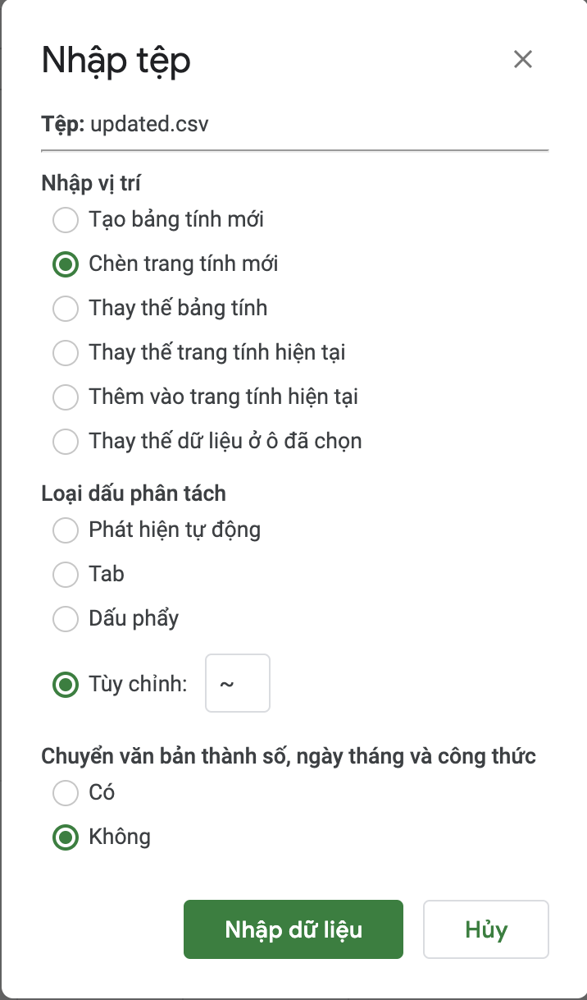

> Đây là kết quả - Shop Sago: https://shopee.vn/sago.menu   
> Shop chuyên bán dép da, dép PU thương hiệu Hữu Cường chính hãng  

---
**Chức năng:**

Input đường dẫn đến shop: trả về toàn bộ (default 100) sản phẩm của shop
Lấy thông tin chi tiết của sản phẩm trong shop
Ghi ra tập csv

**Đặc điểm:**

- Sử dụng lại hình ảnh của shop của trên shopee.
- Không thay đổi hash của hình ảnh
- Kết quả csv chưa phải là kết quả cuối cùng
- Chưa có chức năng tự động chèn khung cho ảnh bìa sản phẩm

**Các bước thực hiện**

- Google tìm "Hướng dẫn cài đặt python windows" rồi làm theo.
- Lấy đường dẫn đến Shop 
- Thay đổi 1 số cấu hình bên trong file `data.py`:
    - DELIVERY\_DEFAULT: đơn vị vận chuyển (tắt/mở)
    - PRE\_ORDER: số ngày đặt hàng trước
    - MODIFY: thông tin cần thay đổi cho tiêu đề và mô tả
    - EXPORT\_FILENAME: tên tập tin kết quả (mặc định export\_shop.csv)
    
- Chạy dòng lệnh để cài đặt thư viện: `python -m pip install -r requirements.txt`
- Chạy công cụ: `python clone_shopee.py` sau đó nhập đường link shopee
- Mở google sheet bất kì (mới hoặc cũ):
    - Chọn `Tệp / File` -> `Nhập / Import` -> `Tải lên / Upload` -> Chọn tập tin `export_shop.csv` -> chọn theo hình đính kèm

      

    - Tải mẫu excel từ shopee: https://banhang.shopee.vn/portal/product/import/download
    - Copy toàn bộ các hàng và cột từ google sheet vào excel của shopee mà không thay đổi bất kì dữ liệu có sẵn nào
    - Tải tập tin excel mới lên shop: https://banhang.shopee.vn/portal/product/import/upload
    - Chọn `cập nhật hàng loạt` để thay đổi 1 số trường giá trị cho toàn bộ sản phẩm
    - Vào từng sản phẩm để chỉnh sửa ảnh bìa hoặc ảnh phân loại (nếu chưa có)
- Hoàn thành
